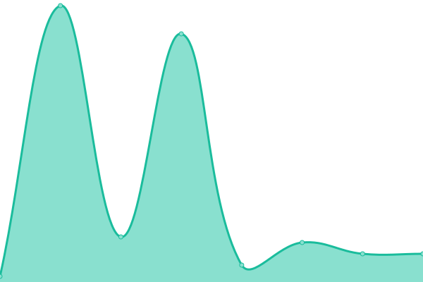
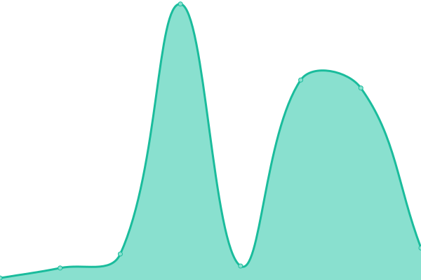

# [📈 Live Status](https://status.onno.com): <!--live status--> **🟩 All systems operational**

This repository contains the open-source uptime monitor and status page for [ONNO T-Shirt Company](https://onno.com/), powered by [Upptime](https://github.com/upptime/upptime).

With [Upptime](https://upptime.js.org), you can get your own unlimited and free uptime monitor and status page, powered entirely by a GitHub repository. We use [Issues](https://github.com/onno-t-shirt-company/upptime/issues) as incident reports, [Actions](https://github.com/onno-t-shirt-company/upptime/actions) as uptime monitors, and [Pages](https://status.onno.com) for the status page.

<!--start: status pages-->
<!-- This summary is generated by Upptime (https://github.com/upptime/upptime) -->
<!-- Do not edit this manually, your changes will be overwritten -->
<!-- prettier-ignore -->
| URL | Status | History | Response Time | Uptime |
| --- | ------ | ------- | ------------- | ------ |
|  [ONNO Homepage](https://onno.com) | 🟩 Up | [onno-homepage.yml](https://github.com/onno-t-shirt-company/upptime/commits/HEAD/history/onno-homepage.yml) | 

 201ms
     
 | 

<a href="https://status.onno.com/history/onno-homepage">100.00%</a>
    

|  [ONNO Login Page](https://onno.com/login) | 🟩 Up | [onno-login-page.yml](https://github.com/onno-t-shirt-company/upptime/commits/HEAD/history/onno-login-page.yml) | 

 497ms
     
 | 

<a href="https://status.onno.com/history/onno-login-page">100.00%</a>
    

|  [ONNO Cart Page](https://onno.com/cart) | 🟩 Up | [onno-cart-page.yml](https://github.com/onno-t-shirt-company/upptime/commits/HEAD/history/onno-cart-page.yml) | 

 457ms
     
 | 

<a href="https://status.onno.com/history/onno-cart-page">100.00%</a>
    

|  [ONNO Men's Bamboo T-Shirt](https://onno.com/store/bamboo-t-shirt-men/) | 🟩 Up | [onno-men-s-bamboo-t-shirt.yml](https://github.com/onno-t-shirt-company/upptime/commits/HEAD/history/onno-men-s-bamboo-t-shirt.yml) | 

 35ms
     
 | 

<a href="https://status.onno.com/history/onno-men-s-bamboo-t-shirt">100.00%</a>
    

|  [ONNO Men's Bamboo Lyocell T-Shirt](https://onno.com/store/bamboo-lyocell-t-shirts-men/) | 🟩 Up | [onno-men-s-bamboo-lyocell-t-shirt.yml](https://github.com/onno-t-shirt-company/upptime/commits/HEAD/history/onno-men-s-bamboo-lyocell-t-shirt.yml) | 

 35ms
     
 | 

<a href="https://status.onno.com/history/onno-men-s-bamboo-lyocell-t-shirt">100.00%</a>
    

|  [ONNO Men's Hemp T-Shirt](https://onno.com/store/hemp-t-shirt-men/) | 🟩 Up | [onno-men-s-hemp-t-shirt.yml](https://github.com/onno-t-shirt-company/upptime/commits/HEAD/history/onno-men-s-hemp-t-shirt.yml) | 

 35ms
     
 | 

<a href="https://status.onno.com/history/onno-men-s-hemp-t-shirt">100.00%</a>
    

|  [ONNO Men's Organic Cotton T-Shirts](https://onno.com/store/organic-cotton-t-shirts-men/) | 🟩 Up | [onno-men-s-organic-cotton-t-shirts.yml](https://github.com/onno-t-shirt-company/upptime/commits/HEAD/history/onno-men-s-organic-cotton-t-shirts.yml) | 

 35ms
     
 | 

<a href="https://status.onno.com/history/onno-men-s-organic-cotton-t-shirts">100.00%</a>
    

|  [ONNO Men's Pima Cotton T-Shirt](https://onno.com/store/pima-cotton-t-shirts-men/) | 🟩 Up | [onno-men-s-pima-cotton-t-shirt.yml](https://github.com/onno-t-shirt-company/upptime/commits/HEAD/history/onno-men-s-pima-cotton-t-shirt.yml) | 

 35ms
     
 | 

<a href="https://status.onno.com/history/onno-men-s-pima-cotton-t-shirt">100.00%</a>
    

|  [ONNO Men's Long Sleeve Bamboo T-Shirt](https://onno.com/store/long-sleeve-bamboo-t-shirt-men/) | 🟩 Up | [onno-men-s-long-sleeve-bamboo-t-shirt.yml](https://github.com/onno-t-shirt-company/upptime/commits/HEAD/history/onno-men-s-long-sleeve-bamboo-t-shirt.yml) | 

 35ms
     
 | 

<a href="https://status.onno.com/history/onno-men-s-long-sleeve-bamboo-t-shirt">100.00%</a>
    

|  [ONNO Factories](https://onno.com/factories.html) | 🟩 Up | [onno-factories.yml](https://github.com/onno-t-shirt-company/upptime/commits/HEAD/history/onno-factories.yml) | 

 35ms
     
 | 

<a href="https://status.onno.com/history/onno-factories">100.00%</a>
    

|  [ONNO Good T-Shirts for the World](https://onno.com/good-t-shirts-for-the-world.html) | 🟩 Up | [onno-good-t-shirts-for-the-world.yml](https://github.com/onno-t-shirt-company/upptime/commits/HEAD/history/onno-good-t-shirts-for-the-world.yml) | 

 68ms
     
 | 

<a href="https://status.onno.com/history/onno-good-t-shirts-for-the-world">100.00%</a>
    

|  [ONNO Women's Bamboo Lyocell T-Shirt](https://onno.com/store/bamboo-lyocell-t-shirts-women/) | 🟩 Up | [onno-women-s-bamboo-lyocell-t-shirt.yml](https://github.com/onno-t-shirt-company/upptime/commits/HEAD/history/onno-women-s-bamboo-lyocell-t-shirt.yml) | 

 68ms
     
 | 

<a href="https://status.onno.com/history/onno-women-s-bamboo-lyocell-t-shirt">100.00%</a>
    

|  [ONNO Women's Bamboo T-Shirt](https://onno.com/store/bamboo-t-shirt-women/) | 🟩 Up | [onno-women-s-bamboo-t-shirt.yml](https://github.com/onno-t-shirt-company/upptime/commits/HEAD/history/onno-women-s-bamboo-t-shirt.yml) | 

 68ms
     
 | 

<a href="https://status.onno.com/history/onno-women-s-bamboo-t-shirt">100.00%</a>
    

|  [ONNO Women's Pima Cottom T-Shirt](https://onno.com/store/pima-cotton-t-shirts-women/) | 🟩 Up | [onno-women-s-pima-cottom-t-shirt.yml](https://github.com/onno-t-shirt-company/upptime/commits/HEAD/history/onno-women-s-pima-cottom-t-shirt.yml) | 

 67ms
     
 | 

<a href="https://status.onno.com/history/onno-women-s-pima-cottom-t-shirt">100.00%</a>
    

|  [ONNO Women's Hemp T-Shirt](https://onno.com/store/hemp-t-shirt-women/) | 🟩 Up | [onno-women-s-hemp-t-shirt.yml](https://github.com/onno-t-shirt-company/upptime/commits/HEAD/history/onno-women-s-hemp-t-shirt.yml) | 

 68ms
     
 | 

<a href="https://status.onno.com/history/onno-women-s-hemp-t-shirt">100.00%</a>
    

|  [ONNO Women's Long Sleve Bamboo T-Shirt](https://onno.com/store/bamboo-t-shirts-long-sleeve-women/) | 🟩 Up | [onno-women-s-long-sleve-bamboo-t-shirt.yml](https://github.com/onno-t-shirt-company/upptime/commits/HEAD/history/onno-women-s-long-sleve-bamboo-t-shirt.yml) | 

 68ms
     
 | 

<a href="https://status.onno.com/history/onno-women-s-long-sleve-bamboo-t-shirt">100.00%</a>
    

<!--end: status pages-->

[**Visit our status website →**](https://status.onno.com)

## 📄 License

- Powered by: [Upptime](https://github.com/upptime/upptime)
- Code: [MIT](./LICENSE) © [ONNO T-Shirt Company](https://onno.com/)
- Data in the `./history` directory: [Open Database License](https://opendatacommons.org/licenses/odbl/1-0/)
